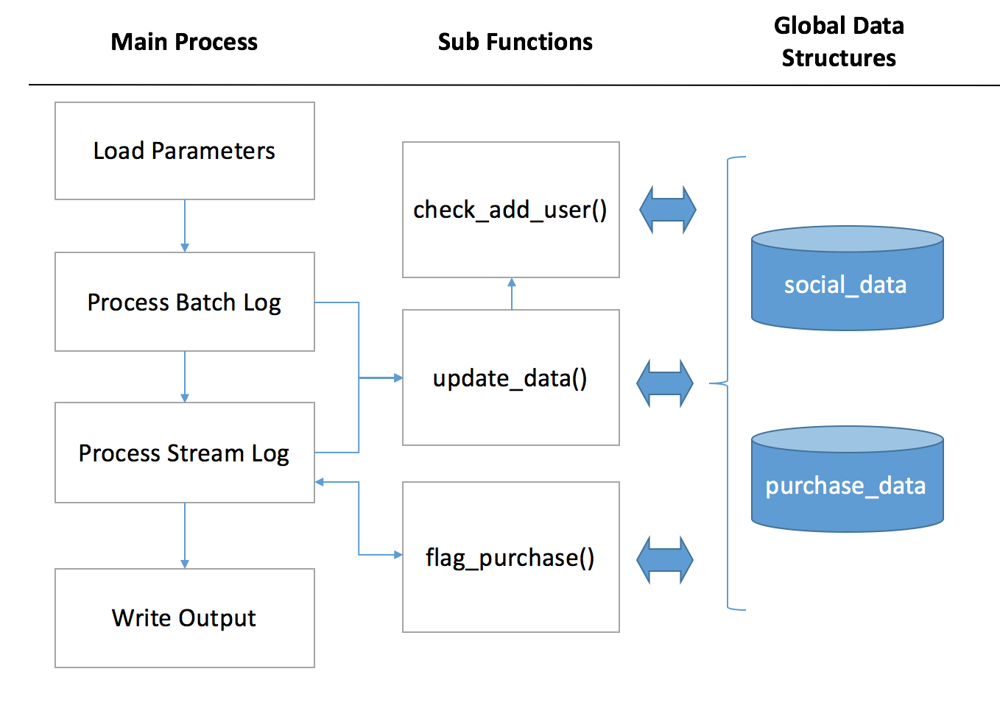

# Table of Contents
1. [Introduction](README.md#introduction)
2. [Code and Data Structure](README.md#code-and-data-structure)
3. [Details of Flagging Process](README.md#details-of-flagging-process)
4. [Testing](README.md#testing)
5. [Improvement Ideas](README.md#improvement-ideas)

# Overview

This source code is my submission to Insight Data Engineering challenge.
It was coded in python3 on Mac OS X and run / tested directly from the shell, so it should be compatible with LINUX as is.
Only standard libraries were used, no need to download any external libraries or component.
For testing and reporting purpose, I added some error and time tracking features.

There is only one source file : flag_anomalies.py

    FILE : flag_anomalies.py
    AUTHOR : S BOUSSIE
    DESCRIPTION : python3 script for insight data engineering challenge
    ARGUMENTS : batch_log_file, stream_log_file, output_file
    LINUX command line : python3 ./src/flag_anomalies.py ./log_input/batch_log.json ./log_input/stream_log.json ./log_output/flagged_purchases.json

Results:
- passed the provided test shell : run_tests.sh
- processed the sample_dataset stream_log.json in 0.89 sec. (on one core), which is less than one second

# Code and Data Structure

###Code Structure

The main process loads batch_log and stream_log files. 
For each event it calls the function udpate_data() to update the shared global data.
For any purchase in the stream_log, the function flag_purchase() is also called to flag anomalies.
The function check_add_user() is called by update_data() to add any new user.

Steps:

    - Load Parameters D and T from batch_log
    - For each event in batch_log :
        - Update global data with event (update_data)
            - Add users if missing (check_add_user)
            - check event type
            - fill social data and purchase data
    - For each event in stream_log :
        - Update global data with event (update_data)
            - Add users if missing (check_add_user)
            - check event type
            - fill social data and purchase data
        - check if purchase is an anomaly (flag_purchase)
            - build user network within the Dth degree
            - collect most T recent transactions within user network
            - compute MEAN and STD
            - flag purchase
    - Write Output

##Data Structure

In order to make it simple and also simulate a shared database, the data is stored in 2 global variables :
- social_data
- puchase_data

### social_data 

This contains users and friendship relationship. Here we want to model an undirected graph.
I use a python dictionnary that contains, for each user, the list of the user's friends.
This structure has a few advantages:
- it is very natural and simple to feed and call in python
- speed : no computation is required to retrieve the friends of one specific user
- memory gain vs. adjacency matrix

To make the process more efficient, String UID are converted into Integer ID (as a user table would do in a database)

Example :
    Let ID 1 and ID 2 be friends.
    social_data  = {1: [2], 2: [1]} 

### purchase_data

This contains the purchase history for each user.
Here again, the most natural way is to use a python dictionnary.
For each user, the dictionnay points to a list of transactions.
For scalability reason,the list is cropped to a maximum of T transactions : there is no need to have more to flag anomalies.

Finally, the process maintains a global integer counter : purchase_counter. 
It is incremented at each new purchase.
This counter is used by the priority rule (for a same timestamp, prioritize transaction the latest logged purchase)
It is also useful to gain speed : instead of comparing timestamp, we compare integer, this is simpler!

Each transaction for each user is composed of a python 2-tuple :(counter, amount)

Example:
    Let ID 1 make two purchases worth $102.1 and $46. It is the 1st and 2nd purchase of the log.
    purchase_data  = {1: [(0, 102.1) ,(1, 46)]}

# Details of Flagging Process

The flagging process, coded in the flag_purchase() function, is based on two processes :
- the algorithm that builds the user's D-th degree social network 
- the algorihtm that collects all the T latest purchases within the network

Performance indicators showed that those 2 processes take the most computing time vs. data structure updates and std/mean computations, and therefore need to be optimized as much as possible.
Overall, the whole process takes 0.89 seconds (after optimization) to process the stream log, which can be broken down into :
    - time to build Dth degree user network : 0.09 sec.
    - time to collect T latest purchases within the network: 0.73 sec. 
    - time to compute STD and MEAN: 0.01 sec.
    - time to load logs, update databse, other : 0.06 sec.

As we can see there is still room for improvement, especially on the T Latest purchase collection.

## Algorithm to build the D user network

I coded a simple version of Breadth-first search algo, that stops after the Dth degree and avoids processing the same user twice.
It is run for each purchase in the stream log. If it was called at each friendship update, it would require to recompute and store the D-th degree network for all users.

The algo uses a simple queue from the module 'deque', that proved much faster than lists.
It also keeps track of each user's degree of friendship (0,1,2,.., D) in the user_network dictionnary.

Algo steps:

    Put original user in user_network, with the degree 0.
    Put original user in queue.
    While queue is not empty, do:
        Collect all friends of the queue's 1st element.
        Collect DEGREE = degree of the queue's 1st element
        For each friend:
            if friend is not already in user_network:
                Add friend to user network, with degree = DEGREE + 1
                Also, if DEGREE +1 < D :
                    Add friend at the end of the queue
    Remove original user from user_network

## Algo to find T latest purchases

Here the process uses two always-sorted lists with a length of T :
- one that stores the counter : transactions_counter. Oldest purchases first
- one that stores the amount : transactions_amount

This solution is faster vs. keeping all transactions and sorting at the end. Also faster than keeping T-length unsorted list and replacing the minimum for each new purchase.
One important detail: for each friend the algo scans the purchases by age order : the most recent first, etc.. . If a purchase is older than the current oldest purchase, then we can stop scanning this specific user.

Algo steps:

    For each friend in the D-th degree user network:
        For each purchase, starting by the most recent purchase :
            if purchase is older than the oldest purchase in transaction_counter : scan the next friend
            find the INDEX (ie the age) of the purchase in transactions_counter
            Insert new counter and new amount in transactions_counter and transactions_amount, at the INDEX place.
            Remove oldest element from transactions_counter and transactions_amount

After this, we are ready to compute STD and MEAN if the number of purchase is more than 2

# Testing

This part describes the various performed testing :
- Data Structures and Algo testing
- Performance Testing
- Robustness Testing

## Data Structures and Algo Testing

### Network Data validation

The objective is to test if the data structure representing the social data (social_data python dictionnary) is well fed by the process. 
I drew a small network (graph) on a paper. Then I wrote the instructions to create the network, adding a few unfriend/befriend, and run the algo, which printed the output social_data variable.
I compared the output with the graph I drew and made sure they were similar

    INPUT : 
    {"event_type":"befriend", "timestamp":"2017-06-13 11:33:01", "id1": "1", "id2": "2"}
    {"event_type":"befriend", "timestamp":"2017-06-13 11:33:01", "id1": "3", "id2": "2"}
    {"event_type":"befriend", "timestamp":"2017-06-13 11:33:01", "id1": "2", "id2": "4"}
    {"event_type":"befriend", "timestamp":"2017-06-13 11:33:01", "id1": "1", "id2": "4"}
    {"event_type":"unfriend", "timestamp":"2017-06-13 11:33:01", "id1": "1", "id2": "4"}
    {"event_type":"befriend", "timestamp":"2017-06-13 11:33:01", "id1": "1", "id2": "5"}
    {"event_type":"unfriend", "timestamp":"2017-06-13 11:33:01", "id1": "1", "id2": "5"}
    {"event_type":"befriend", "timestamp":"2017-06-13 11:33:01", "id1": "1", "id2": "5"}
    {"event_type":"befriend", "timestamp":"2017-06-13 11:33:01", "id1": "1", "id2": "6"}
    {"event_type":"befriend", "timestamp":"2017-06-13 11:33:01", "id1": "2", "id2": "6"}
    {"event_type":"befriend", "timestamp":"2017-06-13 11:33:01", "id1": "4", "id2": "6"}

    OUTPUT :
    social_data : {1: [2, 5, 6], 2: [1, 3, 4, 6], 3: [2], 4: [2, 6], 5: [1], 6: [1, 2, 4]}

Looks good!

### Purchase Data validation

We want to test if the data structure representing the purchase data (purchase_data python dictionnary) is well fed by the process. Specifically, we want to check whether the counter works properly (ie. is incremented on each purchase)
Also, as the process crops the purchase data to a maximum length of T, we want to test for various T.
Finally, we want to see if a new id number during a purchase is well added to the network.

    INPUT : 
    {"D":"3", "T":"50"}
    {"event_type":"befriend", "timestamp":"2017-06-13 11:33:01", "id1": "1", "id2": "2"}
    {"event_type":"befriend", "timestamp":"2017-06-13 11:33:01", "id1": "3", "id2": "2"}
    {"event_type":"befriend", "timestamp":"2017-06-13 11:33:01", "id1": "2", "id2": "4"}
    {"event_type":"befriend", "timestamp":"2017-06-13 11:33:01", "id1": "1", "id2": "4"}
    {"event_type":"unfriend", "timestamp":"2017-06-13 11:33:01", "id1": "1", "id2": "4"}
    {"event_type":"purchase", "timestamp":"2017-06-14 18:46:50", "id": "5", "amount": "10067.99"}
    {"event_type":"befriend", "timestamp":"2017-06-13 11:33:01", "id1": "1", "id2": "5"}
    {"event_type":"unfriend", "timestamp":"2017-06-13 11:33:01", "id1": "1", "id2": "5"}
    {"event_type":"befriend", "timestamp":"2017-06-13 11:33:01", "id1": "1", "id2": "5"}
    {"event_type":"befriend", "timestamp":"2017-06-13 11:33:01", "id1": "1", "id2": "6"}
    {"event_type":"befriend", "timestamp":"2017-06-13 11:33:01", "id1": "2", "id2": "6"}
    {"event_type":"befriend", "timestamp":"2017-06-13 11:33:01", "id1": "4", "id2": "6"}
    {"event_type":"purchase", "timestamp":"2017-06-14 18:46:50", "id": "1", "amount": "47.99"}
    {"event_type":"purchase", "timestamp":"2017-06-14 18:46:50", "id": "1", "amount": "27.99"}
    {"event_type":"purchase", "timestamp":"2017-06-14 18:46:50", "id": "1", "amount": "67.99"}

    OUTPUT :
    social_data : {1: [2, 5, 6], 2: [1, 3, 4, 6], 3: [2], 4: [2, 6], 5: [1], 6: [1, 2, 4]} 
    purchase_data : {1: [(1, 47.99), (2, 27.99), (3, 67.99)], 2: [], 3: [], 4: [], 5: [(0, 10067.99)], 6: []}

Everything is good: ID number 5 was added before 5 was friend to anyone, counter is correct.
Now let's try with a small T to see the oldest trades of each user being removed from the data structure:
    
    INPUT : 
    {"D":"3", "T":"2"}

    OUTPUT:
    purchase_data : {1: [(2, 27.99), (3, 67.99)], 2: [], 3: [], 4: [], 5: [(0, 10067.99)], 6: []}

OK! trade number 1 was removed as expected from user ID 1

### Flagging Algo Testing: Dth-degree Network

Now that we are confident with our data structure, it is time to test our flagging process.
Let's start by the Dth-degree Network.

On top of the network and purchases above, we add one purchase for ID 2 in the stream log

    INPUT STREAM LOG :
    {"event_type":"purchase", "timestamp":"2017-06-14 18:46:50", "id": "2", "amount": "147.99"}

    OUTPUT:
    user_network = [1, 3, 4, 5, 6]

OK, let's try to reduce D to 1  :

    INPUT : 
    {"D":"1", "T":"2"}
    OUTPUT:
    user_network = [1, 3, 4, 6]

Perfect!

### Flagging Algo Testing: Collect T most recent transactions within the network

Let's continue with the previous example and see the state of transactions_counter and transactions_amount from user 2 perspective :
    
    INPUT : 
    {"D":"3", "T":"50"}   
    OUTPUT: 
    TRANSACTIONS COUNTER [0, 1, 2, 3]
    TRANSACTIONS AMOUNTS [10067.99, 47.99, 27.99, 67.99]

Ok, all transactions are taken into account, no anomaly found (it needs an amount of $17,583 to trigger an anomaly)

Let's try with T = 2 :

    INPUT : 
    {"D":"3", "T":"2"}   
    OUTPUT :
    TRANSACTIONS COUNTER [2, 3]
    TRANSACTIONS AMOUNTS [27.99, 67.99]
    anomaly found:
    {'timestamp': '2017-06-14 18:46:50', 'mean': '47.99', 'id': '2', 'event_type': 'purchase', 'amount': '147.99', 'sd': '20.00'}

Ok, 2 oldest transaction was removed plus an anomaly was found.

What if we limit to degre 1 ? 

    INPUT : 
    {"D":"1", "T":"2"}   
    OUTPUT :
    TRANSACTIONS COUNTER [2, 3]
    TRANSACTIONS AMOUNTS [27.99, 67.99]
    anomaly found:
    {'mean': '47.99', 'timestamp': '2017-06-14 18:46:50', 'event_type': 'purchase', 'amount': '147.99', 'id': '2', 'sd': '20.00'}

We have the same result as the previous one as the ID5 transaction was already filtered.

Now let's do the last case with D =1 and T = 50:

    INPUT : 
    {"D":"1", "T":"2"}   
    OUTPUT :
    TRANSACTIONS COUNTER [1, 2, 3]
    TRANSACTIONS AMOUNTS [47.99, 27.99, 67.99]
    anomaly found:
    {'event_type': 'purchase', 'mean': '47.99', 'id': '2', 'sd': '16.33', 'timestamp': '2017-06-14 18:46:50', 'amount': '147.99'}

Perfect : all transactions were taken into account except that of User ID5

## Performance Testing

Performance indicators show that it takes:
- 3.52 seconds to process the batch log
- 0.89 seconds to process the stream log, which can be broken down in :
    - time to build Dth degree user network : 0.09 sec.
    - time to collect T latest purchases within the network: 0.73 sec. 
    - time to compute STD and MEAN: 0.01 sec.
    - time to load logs, update databse, other : 0.06 sec.

These indicators are useful to garantee the process fitness for production ( 1 second of stream logs processed in less than 1 second).
They are also essential to focus the optimization effort on the right part of the code : when I first ran my process, it took 26 seconds, and I managed to bring it down by improving the right function. As another example, STD and MEAN takes negligible time.

## Robustness and Error Tracking

Here are a few error testing results, with INPUT and resulting OUTPUT.

Incorrect Parameter format:
    
    INPUT :  {"D":"3ec", "T":"50"}
    OUTPUT LOG: ERROR : Parameter D error in Batch log

    INPUT : {"D":"3", "T:"50"}
    OUTPUT LOG: ERROR, 1st line not in recognized JSON format

    INPUT : {"D":"3", "T":"50bl"}
    OUTPUT LOG : ERROR : Parameter T error in Batch log

Parameter D too small:

    INPUT: {"D":"0", "T":"50"}
    OUTPUT LOG: ERROR : Parameter D at zero

Parameter T too small :

    INPUT : {"D":"2", "T":"1"}
    OUTPUT : ERROR : Parameter T too low, needs to be >= 2

    INPUT: {"D":"0", "T":"50"}
    OUTPUT LOG: ERROR : Parameter D at zero

wrong JSON format in batch log -> OK
    
    INPUT : {"event_type":"purchase, "timestamp":"2017-06-13 11:33:01", "id": "1", "amount": "16.83"}
    OUTPUT LOG: LINE ERROR, JSON not recognized: {"event_type":"purchas, "timestamp":"2017-06-13 11:33:01", "id": "1", "amount": "16.83"}

Unknown event type in batch log

    INPUT : {"event_type":"unknown", "timestamp":"2017-06-13 11:33:01", "id": "1", "amount": "16.83"}
    OUTPUT LOG: LINE ERROR, Event not recognized {'timestamp': '2017-06-13 11:33:01', 'id': '1', 'amount': '16.83', 'event_type': 'unknown'}

wrong JSON format in stream log

    INPUT: {"event_type":"purchase", "timestamp":2017-06-13 11:33:02", "id": "2", "amount": "1601.83"}
    OUTPUT LOG: LINE ERROR, JSON not recognized {"event_type":"purchase", "timestamp":2017-06-13 11:33:02", "id": "2", "amount": "1601.83"}

Unknown event type in stream log

    INPUT: {"event_type":"sase", "timestamp":"2017-06-13 11:33:02", "id": "2", "amount": "1601.83"}
    OUTPUT: LINE ERROR, Event not recognized {'event_type': 'sase', 'timestamp': '2017-06-13 11:33:02', 'amount': '1601.83', 'id': '2'}

Amount in string instead of figure in a purchase

    INPUT : {"event_type":"purchase", "timestamp":"2017-06-13 11:33:01", "id": "1", "amount": "aa16.83"}
    OUTPUT: LINE ERROR, Invalid purchase amount {'event_type': 'purchase', 'timestamp': '2017-06-13 11:33:01', 'amount': 'aa16.83', 'id': '1'}

Negative Amount :
    
    INPUT : {"event_type":"purchase", "timestamp":"2017-06-13 11:33:01", "id": "1", "amount": "-16.83"}
    OUTPUT: LINE ERROR, Negative purchase amount {'id': '1', 'timestamp': '2017-06-13 11:33:01', 'event_type': 'purchase', 'amount': '-16.83'}

Missing Field in a purchase :
   
    INPUT: {"event_type":"purchase", "timestamp":"2017-06-13 11:33:01", "amount": "59.28"}
    OUTPUT: LINE ERROR - missing field in purchase: id {'amount': '59.28', 'timestamp': '2017-06-13 11:33:01', 'event_type': 'purchase'}

Missing Field in a befriend:

    INPUT: {"event_type":"befriend", "id1": "1", "id2": "2"}
    OUTPUT: LINE ERROR - missing field in befriend: timestamp {'id1': '1', 'event_type': 'befriend', 'id2': '2'}

Missing Field in a unfriend :

    INPUT: {"event_type":"unfriend", "timestamp":"2017-06-13 11:33:01", "id1": "1"}
    OUTPUT : LINE ERROR - missing field in unfriend: id2 {'event_type': 'unfriend', 'timestamp': '2017-06-13 11:33:01', 'id1': '1'}

Thanks for reading !!!
    

